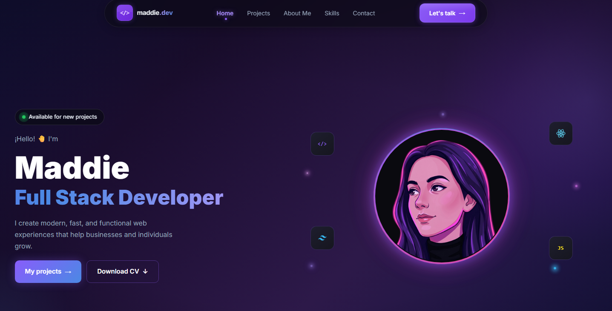

# 🚀 Maddie.dev — Personal Portfolio

<div align="center">



[](https://nextjs.org/)
[](https://react.dev/)
[](https://www.typescriptlang.org/)
[](https://tailwindcss.com/)
[](https://www.framer.com/motion/)
[](https://vercel.com/)

**Personal portfolio of Maddie — Junior Full Stack Developer**

[🌐 Live Demo](https://maddie-portfolio-brown.vercel.app/) · [📧 Contact](mailto:contact_madd@pm.me) · [💼 LinkedIn](https://linkedin.com/in/kuutam)

</div>

---

## ✨ Overview

A personal portfolio designed and built from scratch with a focus on **modern UI/UX**, **smooth animations**, and **fully responsive design**. Built with the most in-demand technologies in today's market.

## 🛠️ Tech Stack

| Category | Technology |
|----------|-----------|
| **Framework** | Next.js 15 (App Router) |
| **UI Library** | React 19 |
| **Language** | TypeScript |
| **Styling** | Tailwind CSS v4 + Custom CSS |
| **Animations** | Framer Motion |
| **Email** | EmailJS |
| **Deployment** | Vercel |

## 📁 Project Structure

```
maddie-portfolio/
├── public/
│   ├── hero-photo.png
│   ├── cv.pdf
│   └── projects/
│       ├── taskflow.png
│       └── ...
├── src/
│   ├── app/
│   │   ├── globals.css
│   │   ├── layout.tsx
│   │   └── page.tsx
│   ├── components/
│   │   ├── Navbar.tsx
│   │   ├── Hero.tsx
│   │   ├── Projects.tsx
│   │   ├── About.tsx
│   │   ├── Skills.tsx
│   │   └── Contact.tsx
│   └── hooks/
│       └── useResponsive.ts
└── README.md
```

## 🎨 Sections

- **Hero** — Introduction with animated circular photo, floating tech icons, and dynamic gradient effect
- **Projects** — Cards with screenshots, technology tags, and links to demo/code
- **About Me** — Personal bio + animated stats cards
- **Skills** — Tech stack organized by category + animated workflow timeline
- **Contact** — Functional contact form with EmailJS + social media links

## 🚀 Getting Started

```bash
# 1. Clone the repository
git clone https://github.com/kuutam/maddie-portfolio.git

# 2. Navigate to the project directory
cd maddie-portfolio

# 3. Install dependencies
npm install

# 4. Set up environment variables
cp .env.example .env.local

# 5. Start the development server
npm run dev
```

Open [http://localhost:3000](http://localhost:3000) in your browser.

## ⚙️ Environment Variables

Create a `.env.local` file in the root of the project:

```env
# EmailJS (for the contact form)
NEXT_PUBLIC_EMAILJS_SERVICE_ID=your_service_id
NEXT_PUBLIC_EMAILJS_TEMPLATE_ID=your_template_id
NEXT_PUBLIC_EMAILJS_PUBLIC_KEY=your_public_key
```

## 📱 Responsive Design

The portfolio is fully optimized for all devices:

| Device | Breakpoint |
|--------|-----------|
| 📱 Mobile | < 768px |
| 📟 Tablet | 768px — 1024px |
| 🖥️ Desktop | > 1024px |

## 🌟 Features

- ✅ **Dark mode** design with purple/blue gradients
- ✅ **Smooth animations** with Framer Motion and CSS keyframes
- ✅ **Floating Navbar** with hamburger menu on mobile
- ✅ **Animated circular photo** with spinning border and glow effect
- ✅ **Functional contact form** powered by EmailJS
- ✅ **Fully responsive** — mobile, tablet and desktop
- ✅ **Optimized performance** with Next.js App Router
- ✅ **Basic SEO** configured
- ✅ **Sequential workflow animation** with pulsing step indicators

## 📦 Available Scripts

```bash
npm run dev      # Start development server
npm run build    # Build for production
npm run start    # Start production server
npm run lint     # Run ESLint
```

## 🚢 Deployment

This project is configured for automatic deployment on **Vercel**.

```bash
# Install Vercel CLI
npm i -g vercel

# Deploy
vercel
```

Or connect your repository directly on [vercel.com](https://vercel.com) for automatic deployment on every push to `main`.

## 📬 Contact

Have a question or want to collaborate?

- 📧 Email: [contact_madd@pm.me](mailto:contact_madd@pm.me)
- 💼 LinkedIn: [Madeline Ascencio](https://linkedin.com/in/kuutam)
- 🐙 GitHub: [@kuutam_o](https://github.com/kuutam)
- 📺 YouTube: [@kaihackss](https://youtube.com/@kaihackss)
- 🎵 TikTok: [@kaihacks](https://tiktok.com/@kaihacks)

---

<div align="center">

Made with ❤️ and lots of coffee ☕ by **Maddie**

⭐ If you like this project, please give it a star!

</div>
